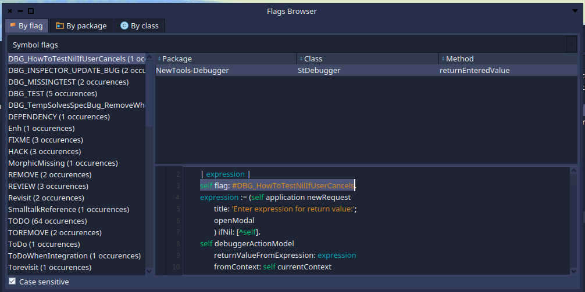

# Flag Browser

The Flag Browser is a Pharo browser useful to find flags developers might have left in the code using the `#flag:` method.

The flag browser is divided into 3 tabs depending on the argument of the `#flag:` method:
- Symbols
- Strings
- Objects
